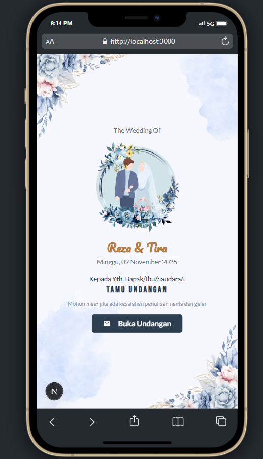

# 💌 Digital Wedding Invitation

A modern, elegant, and responsive digital wedding invitation built with ❤️ using [Next.js 15].

🔗 Live demo: [https://reza-tira-wedding.vercel.app](https://reza-tira-wedding.vercel.app)

---

## 📸 Preview



---

## ✨ Features

- Responsive design for mobile & desktop
- Smooth scroll animations
- Bride & Groom section
- Event schedule
- Location map
- Wishes or guest messages
- Countdown timer
- RSVP form

---

## 🚀 Technologies Used

- HTML5, CSS3, JavaScript
- Next.js
- Tailwind CSS
- Vercel for deployment

---

## 📦 Installation

```bash
# Clone the repo
git clone https://github.com/sandestareza/digital-invitation.git

# Navigate to the project directory
cd digital-invitation

# Install dependencies
npm install

# Run the development server
npm run dev
